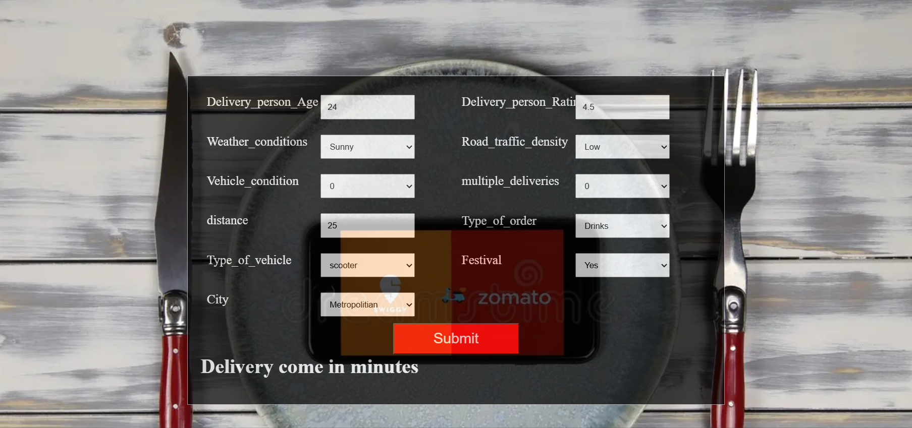
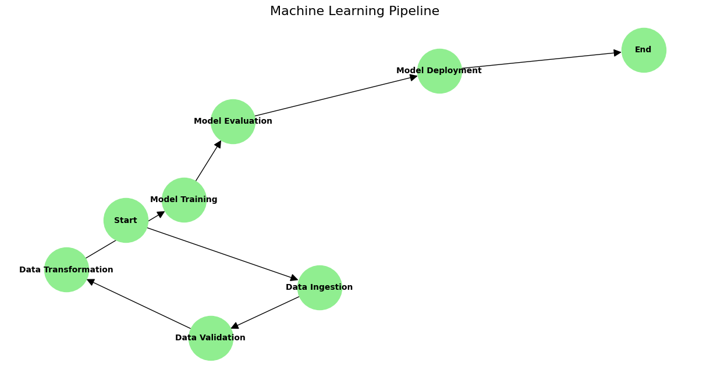

## **Zomato-Delievery-Time-Predictions**

## **Aim :-**
- This project, "End-to-End Machine Learning Pipeline for Zomato Delivery Time Predictions," aims to accurately estimate food delivery times, enhancing Zomato's operational efficiency and customer satisfaction.

1. Create new Enviroment
- conda create -p env python==3.9 -y

2. Activate your Enviroment
- conda activate zomto/ -> CMD

- source activate zomto/ -> Git bash

3. Install your requirements file
- pip install -r requirements.txt

## **Explanation of Workflow:**

**1. Data Ingestion:-**

This step involves collecting and loading the data, such as Zomato delivery records, into the system. This may include reading CSV files, connecting to databases, or accessing APIs.

**2. Data Validation:-**

The ingested data is validated to ensure quality and consistency. This may include:
- Checking for missing values.
- Ensuring data types are correct.
- Verifying data constraints.

**3. Data Transformation:-**

The validated data is preprocessed and transformed to a format suitable for machine learning. This step may include:

**4. Feature engineering:-**

- Normalization or scaling.
- Encoding categorical variables.

**5. Model Training:-**

A machine learning model is trained using the transformed data. Algorithms might include: 
- Regression models.
- Gradient boosting methods.
- Neural networks, depending on the complexity.

**6. Model Evaluation:-**

The trained model is evaluated for accuracy, precision, recall, and other metrics. It ensures the model is robust and performs well.

**7. Model Deployment:-**

The evaluated model is deployed into production, where it can make real-time predictions about delivery times.

